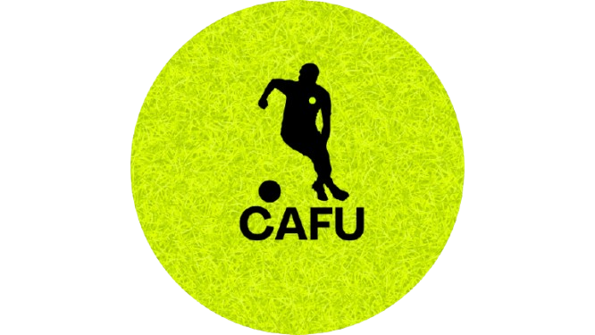

# CAFU

  

<h3 align="center">CAFU</h3>

  <strong>¡Preocúpate solo del 3er tiempo!</strong>
    
  Aplicación móvil para la búsqueda, reserva y gestión de canchas deportivas.

---

## 📋 Tabla de contenido

* [📖 Acerca del proyecto](#-acerca-del-proyecto)
* [🎯 Objetivo](#-objetivo)
* [⚙️ Funcionalidades](#️-funcionalidades)

  * [👤 Para usuarios](#-para-usuarios)
  * [🏢 Para administradores](#-para-administradores)
* [💰 Modelo de negocio](#-modelo-de-negocio)
* [🛠️ Tecnologías](#️-tecnologías)
* [📱 Plataforma](#-plataforma)
* [🚀 Estado del proyecto](#-estado-del-proyecto)

---

## 📖 Acerca del proyecto

**Cafu** es una aplicación móvil desarrollada en **flutter**, diseñada para facilitar la búsqueda, reserva, pago y administración de canchas de fútbol y otros espacios deportivos.

La plataforma conecta a los usuarios que desean alquilar una cancha con los administradores o propietarios de escenarios deportivos que buscan publicar, promocionar y gestionar sus espacios desde una única aplicación.

Cafu busca simplificar todo el proceso de alquiler de canchas, permitiendo que los usuarios encuentren espacios deportivos cercanos o en una ubicación específica, consulten su disponibilidad, filtren resultados según sus necesidades y realicen sus reservas y pagos directamente desde la aplicación.

Por otro lado, los administradores podrán contar con una herramienta integral para gestionar su negocio, controlar sus canchas, reservas, clientes, disponibilidad, ingresos, costos y egresos.

---

## 🎯 Objetivo

El objetivo principal de **Cafu** es digitalizar y simplificar el proceso de alquiler de canchas deportivas.

La aplicación permitirá a los usuarios encontrar y reservar espacios deportivos de forma rápida, sencilla y segura. Al mismo tiempo, ofrecerá a los propietarios y administradores una solución centralizada para gestionar las operaciones de su negocio.

Cafu reunirá en un solo lugar funcionalidades como:

* Búsqueda de canchas.
* Geolocalización.
* Visualización mediante mapas.
* Filtros personalizados.
* Consulta de disponibilidad.
* Reservas.
* Pagos digitales.
* Gestión de clientes.
* Control administrativo y financiero.

---

## ⚙️ Funcionalidades

### 👤 Para usuarios

Los usuarios de Cafu podrán:

* Registrarse e iniciar sesión en la aplicación.
* Gestionar y personalizar su perfil.
* Buscar canchas deportivas disponibles.
* Visualizar canchas cercanas mediante integración con **Google Maps**.
* Buscar canchas en una ubicación específica.
* Utilizar filtros por precio, ubicación y otras características.
* Visualizar información detallada de cada cancha.
* Consultar la disponibilidad de fechas y horarios.
* Reservar canchas deportivas directamente desde la aplicación.
* Realizar pagos mediante la plataforma.
* Consultar y gestionar su historial de reservas.

---

### 🏢 Para administradores

Los propietarios o administradores de escenarios deportivos podrán:

* Registrarse como administradores.
* Publicar canchas sintéticas y otros espacios deportivos.
* Gestionar la información de sus canchas.
* Configurar precios y horarios.
* Gestionar la disponibilidad de cada cancha.
* Consultar las reservas realizadas.
* Identificar qué usuarios han realizado reservas.
* Administrar sus escenarios deportivos desde un solo lugar.
* Consultar estadísticas relacionadas con el alquiler de sus canchas.
* Realizar seguimiento de la ocupación de cada escenario.
* Gestionar los ingresos del negocio.
* Registrar y controlar costos y egresos.
* Obtener una visión general de la gestión administrativa de su negocio.

---

## 🗺️ Geolocalización y búsqueda

Cafu contará con una integración de mapas para facilitar la búsqueda de escenarios deportivos.

Los usuarios podrán:

* Visualizar canchas cercanas a su ubicación.
* Buscar canchas en una ciudad o ubicación determinada.
* Consultar la ubicación exacta de cada escenario deportivo.
* Filtrar los resultados según diferentes criterios.
* Encontrar opciones de acuerdo con el precio y la ubicación deseada.

La funcionalidad de mapas estará basada en la integración con la **API de Google Maps**.

---

## 💳 Reservas y pagos

La aplicación permitirá gestionar el proceso de reserva de una cancha desde la selección hasta el pago.

El proceso general será:

1. El usuario busca una cancha.
2. Consulta su información y disponibilidad.
3. Selecciona la fecha y horario deseado.
4. Realiza la reserva.
5. Efectúa el pago mediante la aplicación.
6. La reserva queda registrada para el usuario y el administrador.

Esto permitirá centralizar el proceso de alquiler y reducir la necesidad de realizar reservas por diferentes medios externos.

---

## 💰 Modelo de negocio

Cafu funcionará como una plataforma intermediaria entre los usuarios que desean alquilar escenarios deportivos y los propietarios o administradores de las canchas.

Por cada reserva realizada y pagada a través de la aplicación, **Cafu recibirá una comisión del 1 % sobre el valor total del alquiler**.

Este modelo permitirá que la plataforma genere ingresos a partir de las transacciones realizadas entre los usuarios y los propietarios de los escenarios deportivos.

---

## 🛠️ Tecnologías

  
  
  
  
  
  
  
  

| Tecnología | Descripción |
| :--- | :--- |
|  **Flutter** | Framework multiplataforma utilizado para construir la aplicación en Android, iOS y Web desde una única base de código. |
|  **Dart** | Lenguaje de programación optimizado para la creación de interfaces de usuario en Flutter. |
|  **Supabase** | Backend en la nube (PostgreSQL) para la gestión de usuarios, base de datos en tiempo real y autenticación. |
|  **Penpot** | Herramienta de diseño UI/UX y prototipado colaborativo para maquetar la experiencia de usuario. |
|  **Postman** | Plataforma para probar y validar las llamadas a APIs, backend y pasarelas de pago. |
|  **VS Code** | Entorno de desarrollo integrado ligero y principal para la programación del proyecto. |
| 🗺️ **Google Maps API** | Servicio de geolocalización para ubicar las canchas sintéticas en el mapa de Bogotá. |
| 💳 **Pasarela de Pagos** | Integración para procesar abonos (50/50, 100% o en sitio) mediante Nequi, Daviplata y PSE. |
|  **Git** | Sistema de control de versiones para la gestión del código fuente. |
|  **GitHub** | Plataforma de almacenamiento del repositorio y colaboración del equipo. |

---

## 📱 Plataforma

El proyecto está diseñado bajo una arquitectura **multiplataforma (Cross-Platform)** para garantizar el acceso desde cualquier dispositivo:

* **Android e iOS:** Desarrollo multiplataforma nativo enfocado en la experiencia del jugador y del capitán de equipo para buscar, reservar y confirmar partidos en segundos.
* **Plataforma Web (PWA):** Pensada tanto para permitir reservas rápidas desde cualquier navegador móvil como para ofrecer a los administradores de las canchas un panel de control accesible desde un computador o tablet sin necesidad de descargas.

---

## 🚀 Estado del proyecto

🚧 **Proyecto en desarrollo**

Actualmente, Cafu se encuentra en etapa de planificación y desarrollo.

Entre las principales funcionalidades proyectadas se encuentran:

* [ ] Sistema de registro e inicio de sesión.
* [ ] Gestión de perfiles de usuario.
* [ ] Gestión de perfiles de administrador.
* [ ] Publicación de canchas deportivas.
* [ ] Búsqueda de canchas.
* [ ] Integración con Google Maps.
* [ ] Geolocalización de escenarios deportivos.
* [ ] Sistema de filtros por ubicación y precio.
* [ ] Visualización de disponibilidad.
* [ ] Sistema de reservas.
* [ ] Historial de reservas.
* [ ] Integración de pagos.
* [ ] Panel administrativo.
* [ ] Gestión de clientes.
* [ ] Gestión de ingresos.
* [ ] Gestión de costos y egresos.
* [ ] Estadísticas y reportes del negocio.
* [ ] Cálculo de la comisión del 1 % por reserva.

---

## 🏆 Visión del proyecto

**Cafu** busca convertirse en una solución integral para la búsqueda, gestión y alquiler de canchas deportivas.

Nuestro objetivo es conectar a quienes buscan un espacio para practicar deporte con los propietarios de escenarios deportivos, facilitando todo el proceso desde la búsqueda hasta la reserva y el pago.

Con Cafu, los usuarios podrán enfocarse en disfrutar del deporte.

### ⚽ ¡Preocúpate solo del 3er tiempo!

---

(<a href="#cafu">Regresar al inicio</a>)

